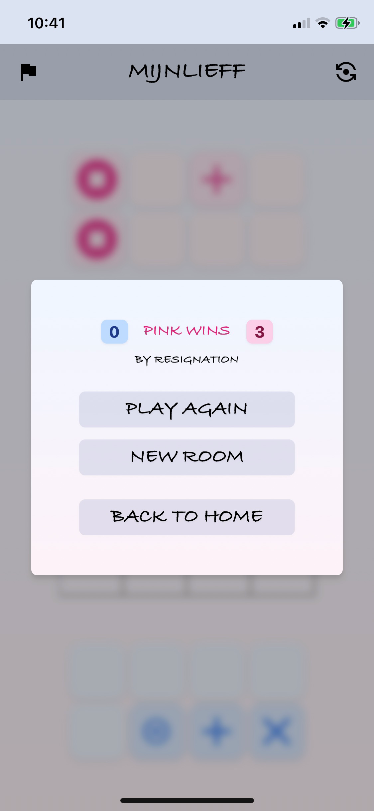

# Mijnlieff - unofficial

This is an unofficial fan-made adaptation of the bagstract game Mijnlieff, designed by Andy Hopwood.

The game is played on a 4 x 4 square grid. Each Player has eight pieces with two of four different symbols.
Each piece when played determines where your opponent can play their next piece. For example you can force your 
opponent to play in a straight line (either othogonally or diagonally) from the piece just played, or to play
next to or away from the piece just played. The aim is to form lines of 3 pieces of your color to get a point
or lines of 4 that worth you two points.

## How to try it

You can try this unofficial app of Mijnlieff game on the website:
- [Mijnlieff Unofficial](https://mijnlieff.netlify.app)

Otherwise you can clone this repo and run it on your pc (make sure to have nodejs)
```
npm i
npm run dev
```

## Screenshots


<div style="display: flex;" align="center">
  
  
</div>
<div style="display: flex;" align="center">
  
  
</div>
